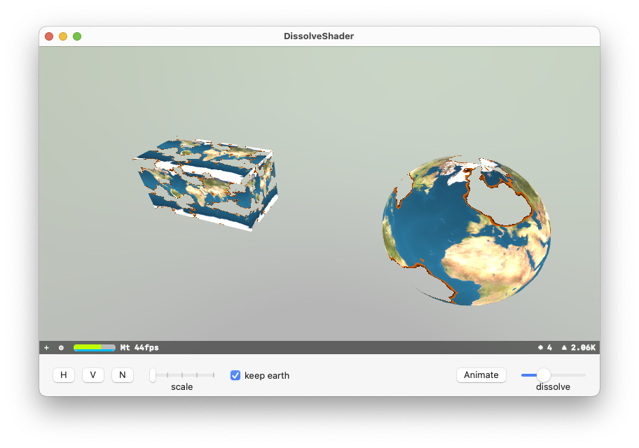

DissolveShader
============
A small SceneKit program to demonstrate a dissolve fragment shader

You can switch the noise pattern from (H)orizontal, (V)ertical or just (N)oise
You can change the pattern repeat scale
You can keep the earth texture or just see the noise pattern
You can select the level of dissolving or animat it

Best rendering is (N)oise,  Scale of 1, keep earth, and play with the disolve slider to see the earth dissolving!

You can left-click and drag to freely rotate the scene, alt + left-click to pan, shift + left-click to zoom

## Check it out!

